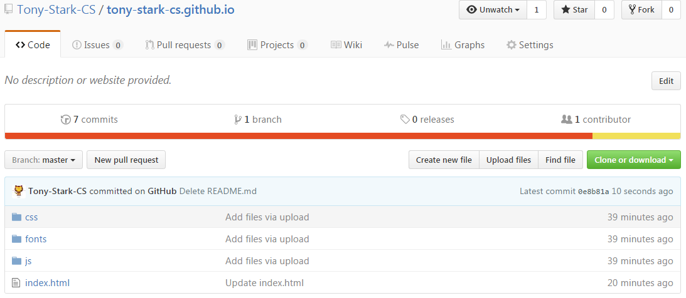

# CSE1210-assignment-2
In this assignment you will be creating a responsive web site hosted on GitHub. To get full marks for the various components it is important that you follow the instructions. To complete tis assignment you must have completed the CodeAcademy [HTML & CSS](https://www.codecademy.com/learn/web) and [Learn HTML & CSS](https://www.codecademy.com/learn/learn-html-css) classes.

## Preliminaries
1. Before starting make sure you have finished the CodeAcademy [HTML & CSS](https://www.codecademy.com/learn/web) and [Learn HTML & CSS](https://www.codecademy.com/learn/learn-html-css) classes.

3. Create a new public repository. It has to be named '''your-user-name.github.io''' where you replace '''you-user-name'' with your GitHub user name, for example GitHub user Tony-Stark-CS would name his repository '''Tony-Stark-CS.github.io''. Note that you are __not__ forking a repository or accepting an assignment repository for this assignment.

4. Go to '''http://http://getbootstrap.com/getting-started/#download''' and select the link button saying ''Download Bootstrap''.

5. Unzip the downloaded file. The unzipped file contains three folders '''css''', '''fonts''', and '''js'''. Add all three folders (and their contents to your new GitHub repository. You can add them by either uploading the folders directly through the browser or adding them to your cloned repository on your computer.

6. Go to '''http://getbootstrap.com/getting-started/#template''', copy the HTML code for the Basic template and add it to a file named '''index.html''. Save the file to your new repository. Your GitHub repository should now look this way.

