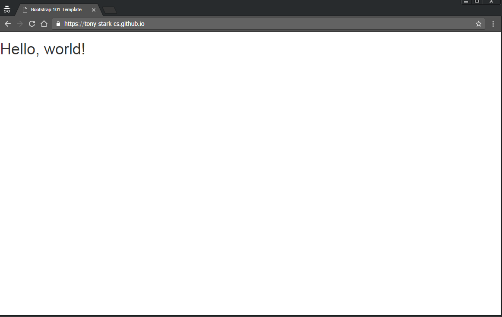

# web-site-assignment
In this assignment you will be creating a multi-site [responsive web site](https://en.wikipedia.org/wiki/Responsive_web_design) hosted on GitHub using the [Bootstrap framework](http://getbootstrap.com/). To get full marks for the various components it is important that you follow the instructions. 

## Set up Bootstrap
Bootstrap is a free and open-source front-end library for designing websites and web applications. It contains HTML- and CSS-based design templates for typography, forms, buttons, navigation and other interface components, as well as optional JavaScript extensions. The first version of Bootstrap was released on january 31, 2012 and was developed by developers at twitter. Bootstrap is using git for sourcecontrol management and is [hosted at GitHub](https://github.com/twbs/bootstrap). To date there has been nearly 18000 commits by almost 1000 people contributing to the Bootstrap framework.

To set up a Bootstrap web page template follow the steps below.

1. Familiarize yourself with Bootstrap and responsive web sites by watching the following videos:
 * https://youtu.be/DX-LoNaUr6w
 * https://youtu.be/gqOEoUR5RHg (1hr video tutorial..., It is recommende that you watch the whole video and then use if as a reference when you are working on your site - note the table of contents/links in the video discription)

2. Create a new public repository by clicking on the green ```New Repository``` button on your GitHub landing page. Your new repository has to be named ```your-user-name.github.io``` where you replace ```you-user-name``` with your GitHub user name, for example GitHub user Tony-Stark-CS would name his repository ```Tony-Stark-CS.github.io```. It is very important that your repository is named exactly this way or it will not work. 


3. Clone the assignment to your Raspberry Pi. 

4. In the next few steps you will download the Bootstrap framwork and add it your new repository. Go to http://http://getbootstrap.com/getting-started/#download and click on the [Download Bootstrap](https://getbootstrap.com/docs/4.0/getting-started/download/) button (you need to download the Compiled CSS and JS).

5. Unzip the downloaded file (using the unzip command on Linux). The unzipped file contains three folders ```css```, ```fonts```, and ```js```. Add all three folders (and their contents to your cloned repository, commit and push to the remote repository.

6. Go to http://getbootstrap.com/getting-started/#template, copy the HTML code for the Basic template and add it to a file named ```index.html```. Save the file to your new repository followed by commit and sync/push. Your GitHub repository should now look like this.


7. Your "web page" is now live (although there is not much on it yet). The URL for your web page is ```https://tony-stark-cs.github.io/index.html``` (where you replace ```tony-stark-cs``` with your own GitHub user name. Every time you update your webpage and commit (and sync/push if you work locally) the changes will be reflected on this web page. Check that you are able to access the site at the designated URl. When you are working on the web page make sure you open it locally (using CTRL-O) and reload it every time you save new markup rather than reloading your live site to check how changes look. There is often a slight delay before the changes take effect on the live site and it is much more efficient to use the local site for checking.



## Creating a web page
Now that you have your basic template for a web page you will add contents to it and format it using HTML, CSS and the Bootstrap framwork. For this part of the assignment you are required to do online research to understand the various components and features that are part of the Bootstrap framework and how incorporate them into your web site. The main [Bootstrap web site](http://getbootstrap.com/) is the best resource for information on the capabilities of the framwork and for code examples. 

Your website will be featuring an artist or group (e.g. musician or music group) of your choice and will consist of the following three inter-linked web pages:
* ```index.html``` - landing page that will introduce the artist and link to the other pages.
* ```history.html``` - subpage that will provide a brief professional history of the artist.
* ```discography.html``` - a subpage listing all (or selected) works (e.g. albums, concerts, exhibits, etc).
 
It is up to you to decide how to format the pages and the type of information to include. To recieve a 50% your site has to include the following components:
* At least ```index.html```, ```history.html``` and ```discography.html``` pages.
* At least 5 embedded images (images must be included in an image directory in your repository).
* At least 5 links to other sites.
* Appropriate written information.
* Proper heading tags, ```<h1>```, ```<h2>```, etc.
* At least one ordered list (```<ol>```) and one unordered list (```<ul>```).
* Each page has to include a ```<hr>``` tag separating the footer from the rest of the page.
* The footer section has to include today's date, a "Created by ..." statement and a link to the hosting GitHub repository.
* The head-section of all the pages have to be properly formated, e.g. include the ```<title>``` tag giving the page title e.g. ```<title>ABBA by Dr. P</title>```, etc.
* Web site has to be attractive, properly formatted and sub pages have to have a consistent look and feel (in this assignment - looks matter!).
* Use of proper English language (grammar and spelling).
 
To get a mark of >50% your site has to include all of the above + the following components:
* Up to 60% - All of the above + modifications of the CSS style sheet (in the ```css`` folder), e.g. background color, link color, font, page dimensions etc.
* Up to 70% - All of the above + [three column grid formatting](http://getbootstrap.com/css/#grid)
* Up to 80% - All of the above + [Navbar](http://getbootstrap.com/components/#navbar) with appropriate links (e.g. to subpages)
* Up to 90% - All of the above + a [carousel with images](http://getbootstrap.com/javascript/#carousel).
* Up to 100% - All of the above + three levels of responsiveness, large screen (e.g. computer monitor), medium screen (e.g. tablet) and small screen (e.g. cell phone). It would make sense to mathc the three levels of responsiveness to the three column gtid layout (three columns <-> two columns <-> single column). 
