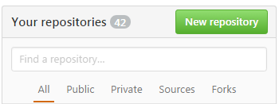

# CSE1210-assignment-2
In this assignment you will be creating a multi-site responsive web site hosted on GitHub using the [Bootstrap framework](http://getbootstrap.com/). To get full marks for the various components it is important that you follow the instructions. To complete this assignment you must have completed the CodeAcademy [HTML & CSS](https://www.codecademy.com/learn/web) and [Learn HTML & CSS](https://www.codecademy.com/learn/learn-html-css) classes.

## Set up Bootstrap
To set up a Bootstrap web page template follow the steps below.

1. Before starting make sure you have finished the CodeAcademy [HTML & CSS](https://www.codecademy.com/learn/web) and [Learn HTML & CSS](https://www.codecademy.com/learn/learn-html-css) classes.

2. Familiarize yourself with Bootstrap and responsive web sites by watching the following videos:
 * https://youtu.be/DX-LoNaUr6w
 * https://youtu.be/gqOEoUR5RHg (1hr video tutorial..., yes you need to watch the whole video)

3. Create a new public repository by clicking on the green ```New Repository``` button on your GitHub landing page. Your new repository has to be named ```your-user-name.github.io``` where you replace ```you-user-name``` with your GitHub user name, for example GitHub user Tony-Stark-CS would name his repository ```Tony-Stark-CS.github.io```. Note that you are __not__ forking this repository or accepting an assignment repository for this assignment..., instead, you are creating and settign up you own repository on GitHub.



4. In the next few steps you will download the Bootstrap framwork and add it your new repository. Go to http://http://getbootstrap.com/getting-started/#download and select the link button saying ```Download Bootstrap```.

5. Unzip the downloaded file. The unzipped file contains three folders ```css```, ```fonts```, and ```js```. Add all three folders (and their contents to your new GitHub repository. You can add them by either uploading the folders directly through the browser or adding them to your cloned repository on your computer.

6. Go to ```http://getbootstrap.com/getting-started/#template```, copy the HTML code for the Basic template and add it to a file named ```index.html```. Save the file to your new repository. Your GitHub repository should now look this way.


7. Your "web page" is now live (although there is not much on it yet). The URL for it is ```https://tony-stark-cs.github.io/index.html``` (where you replace ```tony-stark-cs``` with your own GitHub user name. Every time you update your webpage and commit (and sync/push if you work locally) the changes will be refelected on this web page (there may be a slight delay before the changes appear).

## Creating a web page
Now that you have your basic template for a web page set up you will add contents to it and format it using the Bootstrap framweork. For this part of the assignment you are required to do extensive online research. The main [Bootstrap web site](http://getbootstrap.com/) is a good starting point for information on the capabilities of the framwork and for code examples.

Your website will be featuring a musician or music group of your choice and will consist of the following seperate web pages:
 * ```index.html``` - landing page that will introduce the musician/group and link to the other pages.
 * ```history.html``` - subpage that will provide a brief professional history of the musician/group.
 * ```discography.html``` - a subpage listing all (or selected) albums.
 It is up to you to decide how you want to format the pages and what type of information to include. But your site has to include the following components to recieve a 50% mark:
  * At least 5 embedded images of the musician/group/albums/etc (images have to be part of your repository)
  * At least 5 links to other sites
  * Include appropriate text relatinmg to the musician/group
  * Proper heading tags
  * At least one ordered list and one unordered list
  * Each page has to include a ```<hr>``` tag to separate the footer from the rest of the page
  * The footer section has to include today's date and a "Created by ..." statement
  * The head-section of all the pages have to be properly formated, e.g. include the ```<title>``` tag giving the page title e.g. ```<title>Pink Floyd by Dr. P</title>```.
  * Web page has to be attractive and properly formatted (for this assignment - looks matter!).
 
 To get a mark of >50% your site has to include all of the above + the following components:
 * Up to 60% - All of the above + modifications of the CSS style sheet (in the ```css`` folder), e.g. background color, link color, font, page dimensions etc.
 * Up to 70% - All of the above + [three column grid formatting](http://getbootstrap.com/css/#grid)
 * Up to 80% - [Navbar](http://getbootstrap.com/components/#navbar) with appropriate links (e.g. to subpages)
 * Up to 90% - All of the above + a [carousel with images](http://getbootstrap.com/javascript/#carousel).
 * Up to 100% - All of the above + three levels of responsiveness, large screen (e.g. computer monitor), medium screen (e.g. tablet) and small screen (e.g. cell phone).
